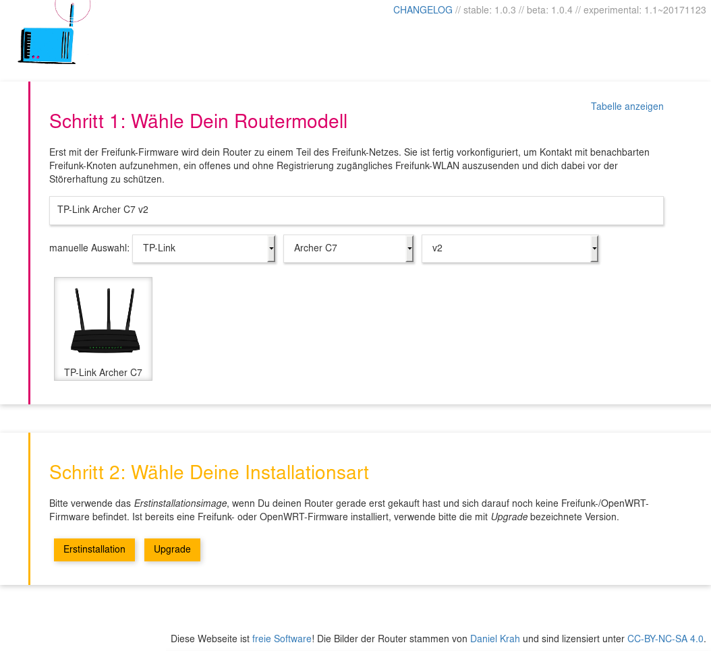

OpenWrt/LEDE Firmware Wizard
---

This Firmware Wizard lets a user select the correct firmware for his device. Directory listings are used to parse the list of available images.

Similar projects:
- [Freifunk Bielefeld Firmware Wizard](https://github.com/freifunk-bielefeld/firmware-wizard/): Based on this wizard, but also supports LEDE and OpenWRT firmware images
- [Freifunk Hennef Firmware Downloader](https://github.com/Freifunk-Hennef/ffhef-fw-dl): Firmware wizard that also contains server-side code (PHP)
- [LibreMesh Chef](https://chef.libremesh.org/): Firmware wizard of LibreMesh that supports building custom images on demand

### Screenshot


### Configuration
Image paths and available branches can be set in `config_template.js` which has to be renamed to `config.js`. In addition, directory listings have to be enabled in your prefered web server:

#### Apache Webserver
Create a `.htaccess` file that enables directory listings:
```
Options +Indexes
```

#### Nginx Webserver
For `nginx`, auto-indexing has to be turned on:
```
location /path/to/builds/ {
    autoindex on;
}
```

#### Python Webserver
For testing purposes or to share files in a LAN, Python can be used. Run `python -m http.server 8080` from within this directory (the directory where `README.md` can be found) and you are done.

#### Docker
```
docker build -t gluon-firmware-selector .
docker run -p 80:80 -v /path/to/firmware/:/images:ro -v /path/to/config.js:/usr/share/nginx/html/config.js:ro --name web_firmware gluon-firmware-selector
```
For https support check [jrcs/letsencrypt-nginx-proxy-companion](https://hub.docker.com/r/jrcs/letsencrypt-nginx-proxy-companion)


### List of available router models
All available router models are specified in `devices.js` via that will match against the filenames.
If no hardware revision is given or is it is empty, the revision is extracted from the file name.

```
{
  <vendor>: {
    <model>: <match>,
    <model>: {<match>: <revision>, ...}
    ...
  }, ...
}
```

If two matches overlap, the longest match will be assigned the matching files. On the other hand, the same match can be used by multiple models without problems.

### License
This program is free software: you can redistribute it and/or modify
it under the terms of the GNU Affero General Public License as published by
the Free Software Foundation, either version 3 of the License, or
(at your option) any later version.
